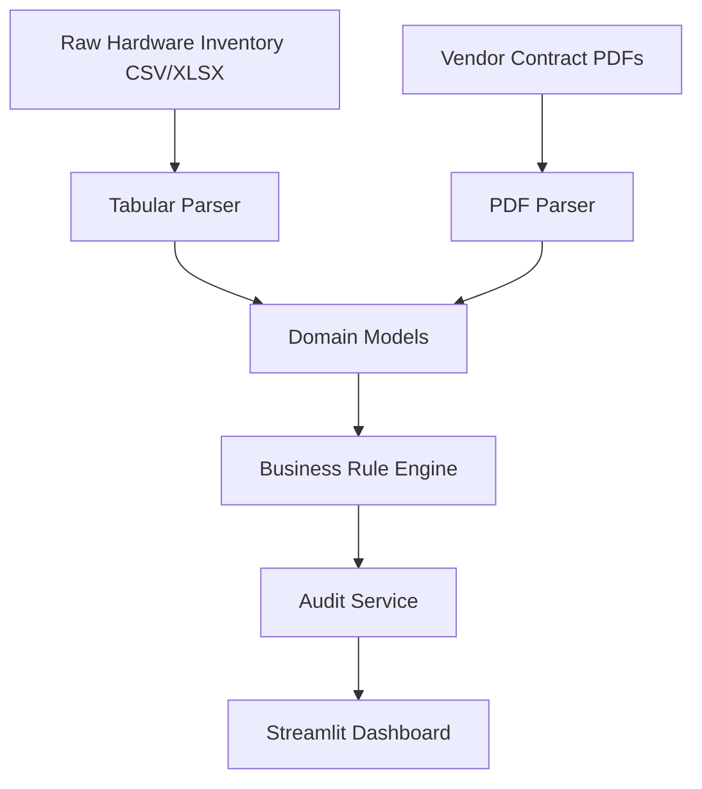

# 📡 Automated IT Due Diligence & M&A Risk Assessment Platform

An enterprise-grade Python application for automating IT infrastructure due diligence during M&A assessments. The platform ingests unstructured vendor contracts (PDFs), cross-references them against large hardware/software inventories, and highlights critical operational risks and financial leaks.

---

## Overview

During M&A technical due diligence, target companies often store infrastructure data in disconnected formats: CSV inventories, Excel license lists, and unstructured PDF Service Level Agreements (SLAs). Manual review is slow, error-prone, and hard to scale.

This platform automates the workflow end-to-end:

1. Generate or ingest inventory data
2. Parse vendor contracts from PDF files
3. Normalize structured and unstructured records
4. Apply business rules to detect risks
5. Render findings in a NOC-style Streamlit dashboard

---

## Why This Project Matters

This project is designed to simulate a real consulting workflow for IT due diligence in M&A. It focuses on:

* Vendor SLA compliance
* Hardware lifecycle exposure
* Software license waste
* Cross-relational risk detection between assets and contracts
* Executive-level reporting for non-technical decision makers

---

## Key Features

* **PDF Contract Ingestion**
  Extracts key SLA fields such as vendor name, validity period, service description, and contract value.

* **Cross-Relational Risk Engine**
  Flags active infrastructure that is not covered by a valid vendor contract.

* **Software Waste Detection**
  Detects expired or unassigned software licenses.

* **Enterprise NOC Dashboard**
  Presents findings in a dark, wide, executive-friendly Streamlit interface.

* **Modular Architecture**
  Uses separated layers for models, parsers, rules, services, and presentation.

---

## Architecture



---

## Project Structure

```text
enterprise-it-due-diligence-engine/
├── .streamlit/
│   └── config.toml
├── data/
│   ├── contracts/
│   ├── raw/
│   └── processed/
├── src/
│   ├── models/
│   ├── parsers/
│   ├── rules/
│   ├── services/
│   ├── config.py
│   └── generator.py
├── dashboard.py
├── main.py
└── README.md
```

---

## Tech Stack

* **Language:** Python 3.10+
* **Data Processing:** Pandas, OpenPyXL
* **PDF Processing:** PDFPlumber, FPDF
* **Visualization:** Plotly Express
* **Web App:** Streamlit
* **Theme:** Dark NOC-style enterprise UI

---

## How It Works

1. **Generate sample assets**
   Creates synthetic hardware and software inventory data.

2. **Generate sample contracts**
   Produces PDF-based vendor SLA contracts for parsing.

3. **Parse & normalize**
   Extracts metadata from PDFs and cleans tabular records.

4. **Run business rules**
   Detects expired contracts, unprotected assets, and license waste.

5. **Visualize findings**
   Displays KPI cards, charts, and red-flag tables in the dashboard.

---

## Sample Output

* Total assets scanned
* SLA violations / red flags
* Idle licenses / waste
* Protected infrastructure count
* Critical operational risks table

---

## Getting Started

### 1. Clone the repository

```bash
git clone https://github.com/faridz15/enterprise-it-due-diligence-engine.git
cd enterprise-it-due-diligence-engine
```

### 2. Create and activate a virtual environment

```bash
python -m venv venv
# Windows
.\venv\Scripts\activate
# macOS / Linux
source venv/bin/activate
```

### 3. Install dependencies

```bash
pip install -r requirements.txt
```

### 4. Run the app

```bash
streamlit run dashboard.py
```

---

## Screenshots


<br>


<br>


```

---

## Roadmap

* [ ] Add OCR support for scanned contracts
* [ ] Expand multi-vendor matching logic
* [ ] Add confidence scoring for PDF extraction
* [ ] Export findings to Excel/PDF executive reports
* [ ] Add automated tests and CI workflow
* [ ] Dockerize the application
* [ ] Add PostgreSQL persistence layer

---

## Notes

This repository uses synthetic data to simulate a realistic due diligence workflow. The goal is to demonstrate architecture, automation logic, and dashboard storytelli
